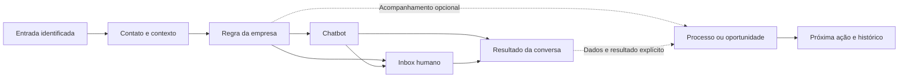

# AutoFluxos: chatbot, operação humana e CRM conectado

> **Plano de produto e interface — revisado em 19/set/2026.**
> Documento principal para a próxima implementação. Substitui as versões
> anteriores desta proposta nas decisões de produto aqui descritas.
>
> **Situação:** planejamento, não funcionalidade entregue. A revisão considerou
> código local, a pesquisa existente e documentação pública. Não houve validação
> em produção, alteração de aplicação, migration ou execução de teste funcional.
>
> Documentos associados:
>
> - [Análise e pesquisa da jornada](ANALISE-19-SET-JORNADA-E-CRM.md): fundamentos e diagnóstico.
> - [Plano técnico por fases](plans/2026-09-19-operacao-chatbot-crm.md): arquivos, tarefas, dependências e verificações.
> - [Banco compartilhado](BANCO-COMPARTILHADO.md): restrições obrigatórias para a implementação.
>
> Este contrato orienta o comportamento futuro. Documentos antigos como
> `MODELO-CRM.md` e `RELACIONAMENTO.md` descrevem decisões anteriores; devem ser
> reconciliados na fase correspondente. Encontrar uma função no código não prova
> que a jornada completa já funciona.

## 1. Decisão de produto

**O AutoFluxos automatiza conversas. A equipe acompanha e assume pelo inbox.
Quem precisa de acompanhamento estruturado ativa o CRM, conectado ao mesmo contato.**

O chatbot é o principal diferencial do produto, mas cada entrada pode começar
com bot, humano ou uma regra condicional. Nenhuma empresa precisa construir um
chatbot vazio para receber atendimento humano. Nenhuma precisa criar um funil
para usar automação, contatos e inbox.

O produto precisa entregar continuidade: o bot pergunta, registra informações e
encaminha; o funcionário recebe o contexto; o acompanhamento preserva o histórico;
os resultados alimentam as próximas ações. Ter os módulos separados no menu não
é suficiente.

### 1.1 Três configurações independentes

| Dimensão | Exemplos | Efeito no produto |
|---|---|---|
| Objetivo da operação | atender, qualificar, agendar, vender, acompanhar | sugere perguntas, encaminhamentos e resultados |
| Contexto do negócio | clínica, oficina, consultoria | adapta linguagem, campos e integrações necessárias |
| Trabalho da pessoa | recepção, SDR, vendedor, pós-venda, gestor | muda atalhos, filas, permissões e tela inicial |

Não haverá um modo exclusivo “empresa SDR” ou “empresa de vendas”. Uma empresa
pode ter vários objetivos e uma pessoa pode exercer várias funções. O nicho
informa os modelos; as permissões dependem das responsabilidades, não do nicho.

### 1.2 Escopo desta entrega

Inclui chatbot com modelos, entrada humana direta, inbox com transferência clara,
contatos com campos estruturados, qualificação configurável, processos opcionais,
oportunidades recorrentes, registro de vendas, atividades, segmentos e permissões.

Ficam para depois: e-mail marketing, estoque, fiscal, conciliação financeira,
comissões, previsão avançada de receita, pontuação preditiva, jornadas multicanal
complexas e catálogo de integrações com CRMs externos. O modelo de dados deve
permitir integrações futuras sem anunciar conectores que ainda não existem.

## 2. Diagnóstico que orienta a mudança

| Evidência no código atual | Consequência | Decisão do plano |
|---|---|---|
| `core/quadros-modelos.ts` usa resultado `ganho` para Resolvido, Qualificado e Compareceu | sucesso operacional pode parecer venda | resultados tipados por finalidade |
| `server/repos/crm.ts` calcula compras a partir de cartões ganhos | atendimento pode contaminar relacionamento e receita | venda tem registro próprio |
| `server/repos/quadros.ts` usa conflito por quadro e contato em passagem automática | recompra no mesmo processo pode não gerar nova ocorrência | várias oportunidades do mesmo contato |
| `acharQuadroPadrao` ordena por padrão e antiguidade, sem exigir padrão | até um quadro não marcado pode receber novos contatos | entrada em processo explicitamente configurada |
| `core/crm.ts` reúne novo, qualificado, cliente, perdido e inativo em um estágio | mistura pessoa, negociação e relacionamento | estados independentes, apresentados em contexto |
| `server/receber-mensagem.ts` verifica automação pausada antes de atribuir origem | origem pode deixar de ser tratada com bot desligado | captura de origem independe do bot |
| `server/receber-lead-do-formulario.ts` retorna cedo para contato existente | novos dados de formulário podem não atualizar seu contexto | registrar toda submissão e conciliar campos |
| `channels/janela.ts` combina 24h e 72h em uma única regra | mistura permissão de envio, origem e benefício de cobrança | políticas separadas e verificadas |
| `app/clientes/[clienteId]/leads/page.tsx` aplica nível depois da paginação; exportação não acompanha esse filtro | lista, quantidade e CSV podem divergir | consulta única de segmentos no servidor |
| `server/sessao.ts` valida principalmente acesso à conta/cliente | associação à empresa não define poderes operacionais suficientes | capacidades e escopos por recurso |
| `server/repos/tarefas.ts` é fila técnica | não representa agenda do vendedor | atividades humanas próprias |
| `vitest.config.ts` carrega `.env`; testes de integração usam Supabase | executar a suíte indiscriminadamente pode escrever no banco compartilhado | ambiente local e bloqueio de produção antes dos testes |

Os caminhos da tabela são relativos a `src/`, exceto a configuração do Vitest.
O plano técnico contém referências mais completas. São constatações de leitura;
problemas de concorrência e comportamento em runtime precisam de testes locais.

## 3. Vocabulário e entidades: contrato obrigatório

| Conceito | Definição | Não deve significar |
|---|---|---|
| Contato | identidade da pessoa e seus dados compartilhados | uma venda ou um cartão específico |
| Conversa | atendimento em um canal, com mensagens e estado operacional | toda a vida comercial da pessoa |
| Entrada | evento de chegada: mensagem, anúncio, formulário, importação | autorização automática para enviar mensagem |
| Qualificação | avaliação para um objetivo, baseada em critérios identificáveis | temperatura, compra ou mudança obrigatória de etapa |
| Processo | sequência de etapas para acompanhar um trabalho | necessariamente um funil comercial |
| Ocorrência | execução de um processo para um contato; representada por um cartão | registro único e permanente por pessoa |
| Oportunidade | intenção de venda específica; pode resultar em uma venda | o próprio contato |
| Venda | registro explícito de uma compra confirmada pela empresa | recebimento financeiro comprovado |
| Atividade | próxima ação humana com responsável e prazo | tarefa técnica de execução do bot |
| Etiqueta | marcação livre e compartilhada pela empresa | fonte oficial de compra, permissão ou origem |
| Segmento | conjunto dinâmico de contatos que satisfazem uma regra | lista congelada de destinatários |
| Modelo de chatbot | ponto de partida copiável para criar uma automação | modelo de mensagem aprovado pelo WhatsApp |

**RB-01 — identidade.** O contato mantém um ID estável por empresa. Número e
identificadores dos canais passam por normalização. Não unir pessoas só pelo nome.
Mudança de número e fusão de duplicados exigem tratamento explícito; na primeira
entrega, casos ambíguos entram em revisão, sem fusão automática destrutiva.

**RB-02 — recorrência.** Um contato pode ter várias conversas ao longo do tempo,
várias ocorrências em um processo e várias oportunidades, inclusive simultâneas.
A mesma pessoa pode ser cliente e ter uma nova oportunidade em aberto.

**RB-03 — finalidade.** Processos são comerciais ou operacionais. “Concluir com
sucesso” em atendimento, qualificação ou agendamento não registra venda. A
finalidade não muda depois de existirem ocorrências; cria-se outro processo e uma
migração assistida, quando necessária.

**RB-04 — oportunidade e cartão.** Cada oportunidade tem identidade estável e
um cartão principal em um processo comercial. Ocorrências de SDR e pós-venda
podem apontar para ela sem duplicar seu valor. Na primeira entrega, não mover uma
oportunidade entre processos comerciais: fechar ou manter a original e abrir
outra vinculada, com confirmação e histórico. Mover entre etapas é permitido.

**RB-05 — resultado comercial.** Oportunidade ganha exige registro de venda.
Há no máximo uma venda válida por oportunidade nesta entrega. Nova compra gera
nova oportunidade. Parcelas não viram compras independentes. Venda avulsa abre
uma oportunidade mínima automaticamente, sem obrigar o operador a preencher um
quadro antes.

**RB-06 — ausência de informação.** “Não informado”, “não avaliado” e “sem registro”
são estados reais. Valor desconhecido não é zero; sem compra registrada não prova
que nunca comprou; sem origem identificada não prova acesso direto.

## 4. Navegação e descoberta

### 4.1 Sidebar definitiva para esta evolução

| Rótulo | Para que serve | Organização interna |
|---|---|---|
| **Visão geral** | entender o que precisa de atenção | indicadores e atalhos conforme acesso |
| **Inbox** | acompanhar bot e atender | filas, conversa e ficha lateral |
| **Contatos** | consultar pessoas e seus contextos | Todos, Clientes, Segmentos |
| **CRM** | trabalhar processos e próximas ações | Oportunidades, Atividades, Processos |
| **Automações** | criar chatbots e regras de funcionamento | Chatbots, Entradas e regras, Sequências |
| **Transmissões** | planejar e acompanhar envios em lote | rascunhos, agendadas, em andamento e histórico |
| **Configurações** | administrar a operação | empresa, canais, equipe e acesso, campos, catálogo e preferências |

Manter as rotas e chaves atuais compatíveis na primeira etapa. Trocar o rótulo
não exige renomear `/fluxos`, `/leads` ou `/quadros`. Links existentes devem
continuar abrindo o contexto correto. Novas rotas internas constam do plano técnico.

**Por que essas escolhas:** “Automações” cobre regras e sequências além do bot;
“Chatbots” deixa claro o que a pessoa está criando; “fluxo” continua útil dentro
do editor visual. “CRM” é o módulo opcional; “Processos” permite atendimento e
pós-venda sem chamar tudo de funil de vendas. “Oportunidades” fica reservado a
negociações comerciais. A adequação dos nomes será testada com usuários no piloto.

### 4.2 O que cada pessoa vê

- Empresa nova começa com chatbot/inbox/contatos; CRM fica disponível em
  Configurações → Recursos, com explicação e botão **Ativar CRM** para gestores.
- Ativar CRM abre a escolha do primeiro processo; não cria cartões retroativos.
  Oferecer importação/revisão separada, com prévia de quantidade.
- Empresa atual que usa quadros mantém CRM visível na migração. Configurações de
  entrada existentes são convertidas para regras explícitas e revisáveis.
- Ocultar CRM da navegação é preferência de interface; não apaga dados, não
  suspende integrações e não revoga acesso. Desativar novas entradas é outra ação.
- Uma pessoa sem acesso ao recurso não recebe o item nem seus dados pela API.
  A preferência de tela inicial respeita as permissões disponíveis.
- Gestor configura; atendente abre Inbox; vendedor pode escolher Oportunidades
  ou Atividades como início. O editor não será imposto como tela inicial.

### 4.3 Automações sem duplicidade de nomes

**Chatbots:** lista com nome, canal, estado, versão publicada, última alteração e
alertas. Botão primário **Criar chatbot** abre **Usar modelo** ou **Começar do zero**.
A galeria de modelos fica nessa jornada e no atalho **Explorar modelos**.

**Entradas e regras:** define o que acontece ao chegar uma mensagem ou formulário,
com origem, prioridade, horário, responsável e criação opcional de acompanhamento.
Palavras-chave, eventos e campanhas de entrada existentes são agrupados aqui.
“Campanha de entrada” identifica aquisição/roteamento; envio em lote fica em
Transmissões. A migração preserva regras e explicita conflitos de prioridade.

**Sequências:** acompanhamento automático ao longo do tempo, com critérios de
entrada e saída. Exibir sempre o que interrompe os envios: resposta, atendimento
humano, compra, descadastro ou outra condição configurada.

Não criar uma aba “Templates” que misture modelos de chatbot e mensagens do
WhatsApp. Estas últimas aparecem como **Modelos de mensagem do WhatsApp**, no
contexto de envio e na administração do canal.

## 5. Entrada, origem e roteamento

### 5.1 Caminho obrigatório de toda entrada

1. Validar empresa, canal e identificador do evento; rejeitar repetição técnica.
2. Identificar/criar contato e registrar o evento e sua proveniência.
3. Atualizar contexto permitido, sem sobrescrever uma correção humana silenciosamente.
4. Quando houver mensagem real, registrar e atualizar o estado da conversa.
5. Avaliar regra de entrada e controles atuais de atendimento/automação.
6. Criar acompanhamento apenas se uma regra explícita determinar isso.
7. Executar bot ou encaminhar à fila humana, registrando a decisão.

**RB-07 — origem independente.** Bot pausado, atendimento humano e CRM desativado
não impedem registrar origem. Guardar primeira origem conhecida e histórico das
entradas posteriores. Uma nova campanha não apaga a origem inicial.

**RB-08 — proveniência.** Guardar tipo de entrada, canal, data, ID do evento
externo quando disponível, anúncio/campanha/formulário e dados brutos necessários
à investigação. Campo indisponível aparece como “Não identificado”. Não inventar
campanha a partir de texto livre nem exibir payload técnico na operação diária.

A oportunidade guarda a entrada que motivou sua criação. Criação manual permite
escolher uma entrada conhecida ou “Sem atribuição”. Reutilizar oportunidade aberta
acrescenta a nova entrada ao histórico, sem substituir sua atribuição original.
Correção dessa ligação exige ação explícita e auditada. Isso é atribuição operacional,
não prova de causalidade da campanha nem cálculo de retorno sobre mídia.

**RB-09 — formulário não é conversa.** Lead de formulário pode criar contato e
acompanhamento, mas não abre janela de conversa do WhatsApp por si só. Contato
existente recebe nova entrada no histórico e conciliação dos campos submetidos.
Importar contato também não simula mensagem recebida.

**RB-10 — idempotência.** Reentrega do mesmo evento não cria mensagem, cartão,
venda ou atribuição duplicada. Uma nova submissão legítima é outra entrada. Usar
ID externo estável quando disponível; fallback documentado por canal. Não deduzir
que duas entradas são iguais só porque ocorreram no mesmo minuto.

### 5.2 Prioridade de decisão

| Ordem | Condição | Comportamento |
|---|---|---|
| 1 | contato com bloqueio de automação ou restrição de envio aplicável | preservar registro; impedir ação vedada |
| 2 | conversa aguardando humano ou sob atendimento humano | manter nessa operação; não reiniciar bot por palavra-chave |
| 3 | sessão de bot ativa e válida | continuar a sessão; interrupção apenas por regra explícita autorizada |
| 4 | regra específica de origem/canal/palavra-chave/horário | aplicar a primeira correspondência na ordem publicada |
| 5 | regra padrão do canal | bot escolhido ou entrada humana |
| 6 | nenhuma regra utilizável | fila humana “Sem responsável”, com motivo visível |

Regras têm ordem explícita, nome e estado. A tela mostra uma simulação de entrada
com a regra vencedora. Sobreposições geram aviso antes da publicação. Não permitir
dois padrões ativos para o mesmo canal. Horários usam o fuso da empresa; o editor
mostra esse fuso. Mudanças valem para próximas decisões, sem reiniciar sessões.

**RB-11 — humano direto.** A entrada pode ir para responsável fixo, equipe com
distribuição ou fila sem responsável. Configurar presença, capacidade e fallback.
Responsável indisponível não deve prender contato indefinidamente: conservar a
atribuição com alerta ou redistribuir segundo política explícita da empresa.

**RB-12 — acompanhamento opcional.** A regra escolhe “Não criar acompanhamento”,
“Abrir ocorrência operacional” ou “Abrir oportunidade”. Configuração inicial de
empresa nova é não criar. Nenhum fallback pode selecionar o quadro mais antigo.

Quando existir oportunidade aberta compatível, a regra deve declarar se reutiliza
a existente ou cria uma nova. Padrão seguro: reutilizar **uma única** oportunidade
aberta no processo de destino; havendo várias, deixar pendência para escolha
humana. Nova intenção/compra pode abrir outra, com vínculo à entrada e sem
unicidade permanente por contato. Reexecução técnica conserva o mesmo resultado.

### 5.3 WhatsApp: exibir três informações distintas

| Informação | Exemplo de apresentação | Efeito |
|---|---|---|
| Origem | “Anúncio · Plano XYZ” | contexto e atribuição |
| Permissão de envio | “Mensagem livre disponível até 14h32” | habilita o compositor correspondente |
| Benefício de cobrança | “Entrada gratuita elegível até …” ou “Não confirmado” | informa condição comercial, sem prometer custo exato |

**RB-13 — janela não é validade do lead.** O contato e a oportunidade não expiram
em 24h ou 72h. Prazos do processo são definidos pela empresa. O servidor reavalia
a permissão imediatamente antes do envio, inclusive em tarefas agendadas.

Existe divergência nas fontes consultadas sobre mensagem livre dentro da janela
gratuita de entrada. A fase 0 deve confirmar a regra oficial aplicável ao provedor
e ao canal antes de ampliar qualquer permissão. Sem evidência suficiente, não
apresentar 72h como autorização geral de texto livre. Separar o cálculo de
cobrança do cálculo de envio; fora da permissão confirmada, oferecer modelo
aprovado quando elegível. A verificação externa está registrada na seção 16.

## 6. Inbox e passagem entre bot e pessoa

### 6.1 Estados separados

| Eixo | Valores | Como aparece |
|---|---|---|
| Situação da conversa | Aberta, Adiada, Encerrada | filtro da fila e cabeçalho |
| Condução | Bot, Aguardando equipe, Em atendimento, Sem condução | um indicador principal no cabeçalho |
| Responsável | pessoa, equipe ou não atribuído | avatar/nome e ação de transferência |
| Automação do contato | permitida ou pausada explicitamente | aviso contextual, com motivo e autor |

Conversa encerrada fica sem condução ativa. Adiar preserva responsável e controle;
nova mensagem reabre a fila, mantendo o atendimento humano quando já assumido.
Aguardar equipe pode ter responsável indicado, mas só **Assumir atendimento**
marca o início efetivo. Atribuir uma pessoa não significa que ela já respondeu.

### 6.2 Ações e efeitos

| Ação | Disponível quando | Efeito obrigatório |
|---|---|---|
| Assumir atendimento | conversa visível e permissão de assumir | pausa execução do bot nessa conversa, atribui operador e inicia atendimento |
| Transferir | permissão de transferir | escolhe pessoa/equipe, registra motivo e mantém bot pausado |
| Devolver à fila | atendimento humano | remove responsável pessoal, mantém aguardando equipe e bot pausado |
| Retomar chatbot | permissão de automação operacional e sem bloqueio incompatível | escolhe bot/ponto seguro e inicia nova execução explícita |
| Encerrar atendimento | conversa aberta sob ação autorizada | conclui atendimento; não registra venda nem cancela atividades automaticamente |
| Adiar | conversa aberta | escolhe data/hora, sai da fila imediata e retorna no prazo ou em nova mensagem |
| Pausar automação do contato | permissão específica | bloqueia novas execuções até reativação explícita |

**RB-14 — um controlador.** Dois atendentes disputando o mesmo atendimento recebem
resultado consistente: apenas um assume a versão atual; o outro vê quem assumiu
e pode solicitar/realizar transferência se autorizado. Atualizar a tela em tempo
real e revalidar no servidor. Não aceitar alteração baseada em estado antigo.

**RB-15 — respostas em andamento.** Assumir invalida a autorização da execução
anterior. Respostas de IA/HTTP que terminarem depois não podem enviar mensagens
nem realizar ações incompatíveis sem verificar novamente o controle. Mensagem
já enviada antes da tomada de controle permanece no histórico.

Na primeira entrega, responder manualmente pelo Inbox exige assumir: o compositor
mostra **Assumir para responder** enquanto a conversa não estiver sob controle do
operador. Outro responsável precisa transferir ou ser substituído por quem tem
permissão. Mensagem humana enviada pelo celular em coexistência interrompe o bot
e aparece como atendimento externo, sem atribuir falsamente um usuário do sistema.
Importação de histórico apenas acrescenta histórico; não reproduz esse efeito.

**RB-16 — retomada.** “Devolver à fila” nunca reinicia o bot. “Retomar chatbot”
explica qual execução começa; o padrão é iniciar por uma entrada segura publicada,
sem retomar cegamente um nó antigo. A pausa persistente do contato precisa ser
removida por pessoa autorizada, com confirmação explícita.

**RB-17 — encerramento.** Pode executar pesquisa/pós-atendimento previamente
configurado, respeitando permissão do canal e bloqueios. Nova mensagem depois de
encerrado inicia um novo ciclo conforme regra de entrada. Manter os ciclos e seus
responsáveis no histórico; não reabrir oportunidades encerradas automaticamente.

### 6.3 Interface da conversa

Cabeçalho: nome, canal, condução, responsável e menu de ações. Etiquetas ficam na
ficha, não competindo com todos os estados no título. Janela de envio aparece ao
lado do compositor quando altera a ação disponível.

Ficha lateral com abas **Resumo, Oportunidades, Atividades, Histórico**. Resumo
mostra origem, campos úteis e última qualificação. Oportunidades mostra abertas
primeiro e permite escolher a negociação em foco; não supor que a mais recente é
a única. Criar oportunidade abre modal sem sair da conversa. Atividades mantém
próxima ação visível. Histórico reúne mensagens e eventos, com filtros por tipo.

Na transferência, apresentar resumo factual: “Cidade: Maringá; interesse: Plano
XYZ; avaliação: atende aos critérios da versão 2”. Informação ausente permanece
visível como não informada. Resumo gerado por IA deve ser identificável e levar às
mensagens de origem; não substituir dados estruturados confirmados.

## 7. Dados, qualificação e marcações

### 7.1 Quatro camadas, sem sinônimos

| Camada | Exemplo | Onde vive |
|---|---|---|
| Dado declarado | cidade = Maringá; interesse = Plano XYZ | contato ou oportunidade, conforme definição |
| Qualificação | atende aos critérios para Plano XYZ | avaliação vinculada ao objetivo/ocorrência |
| Temperatura | Frio, Morno, Quente, Não avaliada | oportunidade específica |
| Relacionamento | compra registrada; última compra conhecida | contato, derivado das vendas válidas |

**RB-18 — qualificado não significa quente.** Conhecer cidade e interesse é
contexto. Só qualificar quando critérios publicados forem atendidos. Temperatura
é decisão separada, manual na primeira entrega, com autor/data; automação futura
só com regra explícita. Não iniciar todos os contatos como mornos.

### 7.2 Campos da empresa

Gestor define campos de contato e de oportunidade: nome, descrição, tipo, opções,
obrigatoriedade contextual, possibilidade de edição e arquivamento. Tipos iniciais:
texto curto/longo, número, moeda, data, sim/não, seleção única e múltipla. Chaves
estáveis preservam referências; renomear muda o rótulo, não o identificador.

Campo de contato descreve a pessoa; campo de oportunidade descreve aquela
negociação. Interesse recorrente pode mudar: guardar resposta da entrada e
copiar para a oportunidade, sem apagar o histórico da anterior.

**RB-19 — atualização e proveniência.** Cada alteração informa origem, autor e
momento. Bot preenche ausentes e os campos para os quais recebeu política de
atualização. Dado corrigido por humano não é sobrescrito silenciosamente por
resposta antiga/importação. Atualização concorrente de campos distintos não pode
substituir o objeto inteiro e perder o outro valor.

**RB-20 — obrigatoriedade contextual.** Campo obrigatório para qualificar ou
fechar venda não impede receber mensagem, criar contato ou salvar rascunho.
Mostrar o que falta na ação que precisa do dado. Conversas e respostas não ficam
bloqueadas porque o cadastro está incompleto.

Etiquetas permanecem livres, com criação/remoção conforme permissão. Não usar
`cliente`, `ouro` ou `qualificado` como única fonte de estados oficiais. Etiquetas
legadas com esses nomes podem permanecer, identificadas como marcações manuais.

### 7.3 Avaliação de qualificação

Gestor cria critérios por objetivo/processo usando campos e operadores compatíveis.
Começar com grupos **Todas estas condições** e **Qualquer destas condições**,
sem exigir linguagem de programação. Resultado:

- **Não avaliado:** ainda não foi executada avaliação.
- **Dados incompletos:** faltam informações para decidir; mostrar quais.
- **Atende aos critérios:** regra satisfeita.
- **Não atende aos critérios:** regra não satisfeita, com motivos objetivos.

A avaliação guarda versão dos critérios, dados usados, resultado e momento.
Ela pode vincular-se à entrada/objetivo mesmo sem CRM; não exigir oportunidade
para um bot coletar informações e qualificar. Ao abrir oportunidade depois,
vincular a avaliação pertinente, sem refazer ou atribuir a todas as negociações.
Alterar critérios não reescreve avaliações passadas; mostrar **Reavaliar**. Não
rotular a pessoa permanentemente como desqualificada para todos os objetivos.

A lógica deve distinguir falso de desconhecido: em “Todas”, uma condição falsa
já determina que não atende; em “Qualquer”, uma verdadeira já determina que atende.
Só indicar dados incompletos quando os dados ausentes puderem mudar o resultado.
Gestor abre **Configurar critérios** no processo ou em Configurações → Campos e
qualificação; operador avalia a versão publicada, sem alterar a regra da empresa.

**RB-21 — passagem ao humano.** Pode acontecer em qualquer resultado, inclusive
quando a pessoa pede ajuda. Pedir humano não transforma a avaliação em positiva.
O modelo SDR atual deve perder essa associação implícita e limites arbitrários
como valor mínimo fixo sem configuração da empresa.

**RB-22 — autonomia.** A empresa pode usar critérios sugeridos pelo modelo e
ajustá-los. Campos, valores mínimos e restrições precisam estar preenchidos antes
de publicar a regra; valores de demonstração não podem virar política real.

## 8. CRM: processos, oportunidades e vendas

### 8.1 Processos

Processos têm nome, finalidade, etapas ordenadas, responsáveis elegíveis e regras
de entrada/saída. Modelos iniciais: Atendimento, Qualificação, Vendas, Agendamento,
Pós-venda. São sugestões editáveis, sem impor uma jornada única a todas as contas.

Ocorrência operacional tem situação **Em andamento, Concluída ou Cancelada**.
Ao concluir, registra resultado da finalidade, como Resolvido, Atende aos critérios,
Não atende aos critérios ou Compareceu. Resultado de qualificação vem da avaliação
válida vinculada; mudar cartão de lugar não produz avaliação aprovada. Cancelar
exige motivo e não conta como sucesso. Etapa terminal informa qual ação abre e
quais dados exige; os rótulos Ganhar/Perder ficam restritos à oportunidade comercial.
Concluir ocorrência e encerrar conversa são ações independentes, mesmo quando
uma regra explícita conectá-las.

O quadro mostra cartões com pessoa, título, responsável, próxima atividade e,
quando comercial, valor estimado. Temperatura é opcional. Contexto completo abre
em painel lateral; clicar no nome abre ficha; **Abrir conversa** mantém o contato
selecionado no Inbox. Não criar abas de navegação para cada processo.

**RB-23 — movimentação.** Arrastar para etapa comum altera apenas a etapa. Arrastar
para conclusão abre a ação adequada à finalidade. Cancelar o modal restaura a
posição; salvar confirma etapa e resultado na mesma operação de negócio. Não
mostrar sucesso visual persistente antes da confirmação do servidor.

**RB-24 — estrutura estável.** Eventos registram IDs e nomes no momento do fato.
Arquivar etapa com cartões exige escolher destino e mostrar dependências. Etapa
referenciada por automação não pode desaparecer silenciosamente. Processo com
histórico é arquivado, não apagado em cascata. Arquivamento impede novas entradas
mas preserva leitura; regras dependentes precisam ser substituídas ou desativadas.

**RB-25 — continuidade entre processos.** Concluir SDR pode abrir uma oportunidade
comercial vinculada, mediante regra configurada. Concluir venda pode abrir
pós-venda. Uma única conclusão não cria duplicatas em novas tentativas. Se o
destino falhar, registrar pendência visível e permitir repetir somente essa ação;
a conclusão de origem não deve ser falsamente apresentada como entrega completa.

### 8.2 Oportunidades

Campos mínimos: contato, título, processo/etapa e responsável ou fila. Valor,
previsão de fechamento, produto/interesse, temperatura e campos adicionais são
opcionais até uma regra contextual exigir. Situação: **Aberta, Ganha, Perdida**.

**RB-26 — nova intenção.** Criar nova oportunidade a partir de contato, conversa
ou quadro. Se houver outras abertas, mostrar resumo e ações **Usar existente** e
**Criar outra mesmo assim**. A escolha é explícita; não bloquear negócios paralelos.

**RB-27 — perda.** Perder oportunidade exige selecionar motivo da empresa ou
“Não informado”, quando permitido pela configuração, sem opção pré-selecionada.
Registrar observação opcional e data. Não mudar o contato para “pessoa perdida”
em outras oportunidades. Reabrir exige permissão e registra evento.

**RB-28 — atividades ao fechar.** Venda/perda mostra atividades abertas. Oferecer
manter, concluir as pertinentes ou cancelar com motivo. Não marcar todas como
feitas automaticamente. Se mantidas, continuam aparecendo na agenda.

### 8.3 Venda e catálogo mínimo

**Registrar venda** é a ação comercial principal. Solicita data da venda, produto
ou serviço quando conhecido, quantidade/valor quando aplicável, valor total
conhecido ou explicitamente não informado e nota/referência opcional. A primeira
versão opera em BRL; não somar moedas diferentes em um mesmo total.

O catálogo mínimo contém produto/serviço, nome e estado ativo/arquivado. Permite
uso em interesse, venda e segmentação. Não inclui estoque, impostos ou ERP.
Itens de venda preservam nome e valor da época; renomear produto não muda histórico.
Se a venda for descrita só em texto, não prometer segmentação confiável por SKU.

**RB-29 — confirmação comercial.** Venda registrada significa que a empresa
confirmou a compra. Não significa “pago”. Pagamento fica **Não acompanhado** por
padrão; eventual marcação manual precisa dizer que é manual. Integração futura
com pagamento terá sua própria origem e conciliação.

**RB-30 — integridade.** Venda e fechamento da oportunidade são atômicos. Repetir
clique/requisição retorna o mesmo registro. Valor total informado precisa ser
consistente com os itens quando todos forem conhecidos; não trocar desconhecido
por zero. Ajustes/descontos exigem representação explícita, sem somas contraditórias.

**RB-31 — correção.** Corrigir valor/data/itens mantém trilha de auditoria. Cancelar
registro de venda exige motivo e o retira dos indicadores válidos; não apaga o
registro. Informar que isso não efetua estorno financeiro. O modal exige escolher
o destino da oportunidade: **Reabrir** ou **Marcar como perdida**, com motivo.
Cancelar venda e alterar situação ocorrem juntos; não deixar oportunidade ganha
sem venda válida. Corrigir dados de uma venda válida não reabre a negociação.
Ganhar novamente reutiliza a identidade da venda com revisão auditável, sem criar
duas compras válidas para a mesma
oportunidade. Devoluções parciais e múltiplas vendas por oportunidade ficam fora.

**RB-32 — legado incerto.** Ganhos antigos entram como resultados legados até
classificação. Não converter automaticamente “Resolvido”, “Qualificado” ou
“Compareceu” em compra. Nome do quadro, etiqueta e valor positivo isolados não
são prova. Revisão por gestor permite confirmar venda e dados disponíveis; métricas
separam registros revisados dos pendentes. Não inventar produto/data/valor.

## 9. Atividades e trabalho diário

Atividades de atendimento podem ser usadas no Inbox/ficha mesmo sem CRM; nesse
caso, Visão geral oferece o atalho **Minhas atividades**. A aba do CRM reúne a
agenda comercial quando o módulo estiver ativo. Campos, etiquetas e qualificação
também não dependem de criar processo ou oportunidade.

Atividades têm título, tipo simples (contato, reunião, tarefa), contato,
oportunidade/ocorrência opcional, responsável, prazo e observação. Estados:
**Pendente, Concluída, Cancelada**. “Atrasada” é calculado pelo prazo; não é outro
estado que alguém precise atualizar. Datas são armazenadas de forma inequívoca e
exibidas no fuso da empresa, com informação do fuso no agendamento.

CRM → Atividades mostra **Hoje, Atrasadas, Próximas, Sem prazo**, com filtro por
responsável/equipe. Inbox e ficha mostram a próxima ação. Processo pode recomendar
uma próxima atividade; obrigatoriedade só deve existir em transições configuradas,
com alternativa explícita “Sem próxima ação” e motivo quando exigido.

**RB-33 — lembrete não é envio.** Criar atividade não agenda WhatsApp. A interface
separa **Lembrar de entrar em contato** e **Agendar mensagem**, com respectivas
permissões e restrições de canal. Adiar conversa também não conclui atividade.

**RB-34 — notificações.** Central interna/indicadores mostram nova atribuição,
transferência, atividade vencida e falha que exige ação. Notificação liga ao objeto
correto, respeita escopo e não duplica a cada atualização. Novos canais de notificação por e-mail/push ficam fora
desta evolução; preservar o push existente onde já estiver configurado. O usuário deve conseguir silenciar lembretes sem desativar
visibilidade de pendências na própria fila.

## 10. Relacionamento e segmentação

### 10.1 O que sabemos sobre o relacionamento

| Indicador | Fonte | Tratamento de ausência |
|---|---|---|
| Cliente com compra registrada | ao menos uma venda válida | sem registro não significa nunca comprou |
| Cliente declarado/importado | declaração explícita com origem | não inventa venda ou receita |
| Quantidade de compras | vendas válidas distintas | exclui resultados operacionais e canceladas |
| Valor conhecido acumulado | totais conhecidos de vendas válidas | mostrar “há vendas sem valor informado” |
| Última compra conhecida | maior data válida conhecida | desconhecida permanece desconhecida |
| Última interação | mensagens/interações reais identificadas | separada da data de compra |
| Faixa de valor | regra da empresa sobre valor conhecido | “Dados insuficientes” quando não há base |

Não iniciar Ouro/Prata/Bronze com limites universais. Oferecer esses nomes como
modelo opcional de faixas editáveis, com moeda, limites sem sobreposição e prévia
de distribuição. Usar “faixa de valor conhecido”, sem dizer que mede toda a
qualidade ou fidelidade do cliente. RFM completo fica para uma evolução posterior.

**RB-35 — recompra.** “Cliente sem comprar há X dias” exige compra com data conhecida.
Cliente importado sem histórico fica em grupo próprio. “Oportunidade fria” usa
sua temperatura; “Sem interação há X dias” usa interação. Não fundir esses casos
em um status universal “inativo”.

### 10.2 Segmentos configuráveis

Contatos → Segmentos oferece modelos editáveis e **Criar segmento**. Exemplos:
interessados no Plano XYZ em Maringá; oportunidades frias em aberto; clientes sem
compra há 90 dias; clientes importados sem histórico; sem responsável; com
atividades vencidas. “90 dias” é sugestão editável, não regra fixa do produto.

Operadores iniciais: igual/diferente, contém quando cabível, maior/menor, intervalo,
está preenchido/não informado, tem/não tem, antes/depois e há mais/menos de X dias.
Cada operador respeita tipo do campo. O editor combina grupos todas/qualquer sem
aninhamento arbitrário na primeira versão.

**RB-36 — mesma ocorrência.** Filtro “oportunidade fria E aberta no processo X”
deve ser satisfeito pela mesma oportunidade. Não juntar temperatura de uma
negociação com estado de outra. Filtro “comprou produto X nos últimos 90 dias”
também deve olhar a mesma venda/item. Mostrar na prévia o motivo de inclusão.

**RB-37 — consulta única.** Lista, contagem, paginação, exportação e seleção em lote
usam a mesma definição no servidor e o mesmo escopo de acesso. Contatos aparecem
uma vez, mesmo com várias oportunidades correspondentes. Calcular filtros antes
de paginar. Exportação registra o momento da consulta e obedece sua permissão.

**RB-38 — objetos diferentes.** Visão salva guarda filtros/colunas para trabalho
pessoal. Segmento guarda regra reutilizável e dinâmica, compartilhada conforme
permissão. Transmissão materializa destinatários numa lista do envio, para
rastreabilidade; não altera retroativamente essa lista a cada mudança do segmento.

**RB-39 — elegibilidade do envio.** Estar no segmento não autoriza mensagem.
A prévia separa total correspondente, elegível e excluído por motivo. Antes de
cada envio, revalidar bloqueios, permissões do canal e demais restrições. Mudanças
posteriores de segmento não acrescentam destinatários ao lote já confirmado.

### 10.3 Interface de leitura dos contatos

Lista mostra nome, responsável, últimas interações e campos escolhidos. Colunas
comerciais aparecem quando pertinentes e autorizadas. Clique abre ficha com
**Resumo, Conversas, Oportunidades, Atividades, Histórico**. “Clientes” é uma visão
dos mesmos contatos, com indicador de compra registrada ou condição declarada;
não cria outro cadastro independente.

Indicadores do histórico distinguem autor humano, bot, integração e migração.
Filtros permitem ver qualificação, vendas, etapas e mudanças de responsável.
Dados financeiros ocultos por permissão não devem ser inferíveis por contagens,
faixas ou exportações sem a mesma autorização.

## 11. Papéis, equipes e permissões

Reutilizar a autenticação existente. Adicionar autorização de negócio no servidor,
sem criar outro sistema de login. Papéis iniciais são modelos editáveis pelo
administrador; não estão vinculados a profissões.

| Capacidade | Administrador | Gestor | Operador |
|---|---|---|---|
| Configurar empresa/canais/equipe e papéis | sim | somente se delegado | não |
| Configurar bot, regras, campos e processos | sim | sim | não |
| Ler/atender conversas e editar dados operacionais | todos | equipe ou todos | atribuídos/equipe conforme configuração |
| Criar oportunidade e atividade | sim | no escopo | no escopo, quando habilitado |
| Registrar venda/perda | sim | no escopo | quando habilitado |
| Corrigir/cancelar venda | sim | quando delegado | não por padrão |
| Ler valores comerciais | sim | quando habilitado | quando habilitado |
| Exportar, criar segmento compartilhado ou transmitir | sim | permissões independentes | não por padrão |

**RB-40 — escopo.** Próprios, equipe e todos são escopos explícitos por recurso.
Fila sem responsável precisa de regra própria de acesso; não é de todos por
acidente. Atribuição comercial e responsabilidade de atendimento são distintas,
com indicadores próprios e transferência que explica o que será alterado.

**RB-41 — contato compartilhado.** Poder atender uma conversa dá acesso ao contexto
mínimo necessário do contato, mas não a todas as oportunidades de outras equipes.
Oportunidades/atividades vinculadas mantêm seu escopo; agregados comerciais só
aparecem para quem tem autorização para a base correspondente. Ficha, busca,
segmento, CSV, notificações e realtime devem aplicar as mesmas restrições.

**RB-42 — servidor autoritativo.** Esconder botão não é controle de acesso. Toda
ação verifica empresa, capacidade e escopo. Serviços de automação operam com
identidade e política explícitas; uso de `service_role` não substitui isolamento.
Manter administração global existente com trilha de auditoria.

Na migração, preservar acesso atual por um papel de compatibilidade identificado,
com revisão assistida pelo administrador. Não retirar acesso de operadores em
massa sem prévia. Novas contas começam com permissões mínimas dos modelos acima.
Remover alguém da equipe exige decidir destino das atribuições e atividades
abertas; nunca deixar referências sem tratamento.

## 12. Chatbots, modelos e publicação

### 12.1 Jornada de criação

1. **Criar chatbot** → escolher objetivo ou começar do zero.
2. Modelo mostra finalidade, perguntas, dados coletados, resultado, passagem ao
   humano e integrações necessárias. Ver exemplo antes de escolher.
3. Informar nome e canal; criar rascunho privado à operação da empresa.
4. Configurar campos/critérios, mensagens, horários e encaminhamento sugeridos.
5. **Testar** abre simulação, sem enviar mensagens reais nem criar vendas/cartões.
6. **Publicar** valida dependências e apresenta resumo das alterações.
7. Se ainda não houver entrada ligada ao chatbot, oferecer **Configurar entrada**.
   Publicar não liga o bot silenciosamente a todos os canais.

**RB-43 — cópia independente.** Usar modelo copia uma versão para rascunho editável.
Atualização da biblioteca não modifica bots existentes. Sugerir atualização com
comparação futura; não sincronizar automaticamente.

**RB-44 — ciclo.** Estados: Rascunho, Publicado, Pausado, Arquivado. Bot publicado
pode ter alterações em rascunho; a interface mostra ambos. Publicar nova versão
não altera sessões em andamento, que concluem na versão iniciada salvo interrupção
explícita. Pausar impede novas sessões e, por padrão, permite concluir as ativas;
o modal mostra essa escolha e oferece **Interromper e encaminhar à equipe** quando
a intenção for parada imediata. A pausa persistente do contato interrompe sua
execução, conforme os controles da conversa. Arquivar exige resolver entradas
dependentes e sessões ativas, preservando histórico.

**RB-45 — validação.** Bloquear publicação quando faltarem destino obrigatório,
campo referenciado, credencial exigida, mensagem essencial ou saída válida. Avisar
sobre loops e caminhos sem conclusão/transferência. Rascunho incompleto pode ser
salvo. Links de exemplo, IDs fictícios e critérios de demonstração precisam ser
substituídos ou explicitamente removidos antes da publicação.

**RB-46 — resultados explícitos.** O editor diferencia ações “Salvar informação”,
“Avaliar qualificação”, “Encaminhar para equipe”, “Abrir acompanhamento” e
“Concluir processo”. Registrar venda por automação fica bloqueado por padrão;
integração futura precisará de evento confiável, permissão e contrato idempotente.
Uma mensagem do bot dizendo “venda concluída” não é evidência comercial suficiente.

Modelos iniciais priorizam atendimento com menu, coleta/qualificação, passagem
humana e pós-atendimento. Agendamento só promete reserva real quando houver
integração configurada; caso contrário, coleta preferência e encaminha. Não
apresentar integração específica da Verandi como requisito universal do produto.

### 12.2 Sequências e automações de acompanhamento

Uma sequência tem objetivo, entrada, etapas com prazo, horário permitido, critérios
de saída e versão publicada. Cada inscrição guarda contato, canal e, quando
comercial, oportunidade de referência. Estados: **Ativa, Pausada, Concluída,
Cancelada, Com falha**. A tela mostra próximo passo e motivo de pausa/saída.

**RB-47 — acompanhamento com contexto.** A empresa configura saída ao responder,
comprar ou mudar de etapa, sempre no vínculo pertinente. Compra em outra
negociação não encerra automaticamente toda sequência do contato. O padrão de
prospecção é cancelar ao receber resposta e entregar ao atendimento; a pessoa
pode ser reinscrita por ação/regra explícita, nunca por mera reentrega do evento.

**RB-48 — prioridade humana nos envios.** Durante atendimento humano ou pausa
persistente, suspender envios automáticos conflitantes. Encerrar atendimento não
retoma uma sequência sozinho. A retomada autorizada mostra o próximo passo e
recalcula o prazo a partir do momento atual, sem disparar de uma vez todos os
passos vencidos. Antes de enviar, conferir controle da conversa, política do
canal, bloqueios e validade da inscrição, inclusive em jobs já enfileirados.

Chatbot, sequência e transmissão passam pela mesma verificação de elegibilidade e
controle; não podem contornar o atendimento por caminhos de envio diferentes.
Na primeira versão, transmissão automática aguarda o fim do atendimento ou expira
como não enviada segundo o prazo do lote. A prévia informa essa exclusão/espera.
Resposta a uma transmissão usa as regras normais de entrada, preservando o vínculo
com o envio que a originou quando o canal permitir identificar esse contexto.

Reutilizar as sequências existentes e migrar suas políticas explicitamente. Não
reescrever eventos históricos como novas inscrições. Editar uma sequência cria
rascunho; inscrições ativas conservam a versão iniciada, salvo cancelamento ou
migração explicitamente revisada. Descadastro/bloqueio impede envios pertinentes
mesmo que uma inscrição antiga ainda esteja armazenada.

## 13. Contrato de telas, modais e feedback

### 13.1 Comportamento comum

- Ação simples e reversível, como atribuir etiqueta, pode salvar no contexto com
  feedback discreto. Ação que cria, conclui, transfere ou cancela usa formulário
  claro e mostra suas consequências antes de confirmar.
- Formulário tem carregamento, edição, validação, salvamento, sucesso, falha e
  conflito. Durante salvamento, impedir submissão repetida. Erro preserva dados.
- Campo inválido recebe mensagem específica; erro geral aparece no formulário.
  Falha de rede permite tentar novamente com a mesma chave de operação.
- Fechar formulário alterado pede confirmação de descarte. Evitar modal sobre
  modal: mostrar confirmação no mesmo diálogo ou trocar seu conteúdo.
- Diálogo recebe foco, mantém navegação por teclado e devolve foco ao acionador.
  Escape/backdrop seguem a proteção de dados não salvos. Título e erros acessíveis;
  status não depende só de cor. Preservar componentes/tokens visuais atuais.
- Ao receber atualização concorrente, mostrar “Este registro foi alterado por
  outra pessoa” e oferecer recarregar/reaplicar, sem sobrescrever silenciosamente.
- Desktop usa painel lateral para contexto persistente. Em tela estreita, ficha
  ocupa tela com voltar preservando filtro, rolagem e rascunho da conversa.
- Se a ação não puder ser feita por estado, mostrar motivo. Se não houver
  permissão, mostrar leitura quando autorizada e omitir ações sem acesso.

### 13.2 Catálogo das ações principais

| ID / abertura | Conteúdo e confirmação | Após salvar / impedimentos |
|---|---|---|
| UI-01 · Criar chatbot, em Automações | objetivo, modelo/zero, nome e canal; **Criar rascunho** | abre editor; não publica nem envia |
| UI-02 · Publicar, no editor | validação, mudanças, dependências e destino das novas sessões; **Publicar versão** | mostra versão e entradas ligadas; bloqueia pendências essenciais |
| UI-03 · Nova/editar regra, em Entradas e regras | condições, prioridade, horário/fuso, bot/humano, fallback e acompanhamento opcional; **Salvar rascunho** e **Publicar regra** | simula correspondência; conflitos visíveis antes de ativar |
| UI-04 · Assumir, no Inbox | ação direta se conversa disponível; transferência existente exige tratamento próprio | cabeçalho muda após confirmação do servidor; conflito mostra atual responsável |
| UI-05 · Transferir, no Inbox | pessoa/equipe, disponibilidade, nota e efeito na responsabilidade comercial quando solicitado; **Transferir atendimento** | preserva bot pausado e notifica destino; sem destino válido não confirma |
| UI-06 · Retomar chatbot, no Inbox | bot/versão publicada, entrada segura, resumo do efeito e eventual remoção autorizada de pausa; **Retomar chatbot** | nova execução auditada; bloqueio de contato exige decisão explícita |
| UI-07 · Encerrar, no Inbox | motivo operacional opcional, atividades pendentes e pós-atendimento previsto; **Encerrar atendimento** | conversa encerrada; não marca venda; falha do pós-atendimento fica visível |
| UI-08 · Avaliar qualificação, na ficha/editor de critérios | objetivo, respostas, faltantes e resultado; **Salvar avaliação** | avaliação versionada no histórico; incompleto não vira aprovado |
| UI-09 · Nova oportunidade, na ficha/Inbox/quadro | contato, título, processo, etapa e responsável; outras abertas visíveis; **Criar oportunidade** | abre painel da nova; contato já existente não é duplicado |
| UI-10 · Registrar venda, na oportunidade ou ficha | data, itens/produto, valor conhecido ou não informado, nota e tratamento das atividades; **Registrar venda** | oportunidade ganha e venda única; confirmação informa limites do registro financeiro |
| UI-11 · Marcar como perdida, na oportunidade | motivo sem preseleção, observação e atividades; **Marcar como perdida** | oportunidade perdida, outras preservadas; regra de motivo aplicada |
| UI-12 · Corrigir/cancelar venda, no histórico | dados atuais, alteração/motivo, destino da oportunidade no cancelamento e impacto nos indicadores; **Salvar correção** ou **Cancelar registro de venda** | revisão auditável e totais recalculados; não executa estorno |
| UI-13 · Criar/editar atividade, no Inbox/ficha/CRM | título, responsável, prazo/fuso, vínculo e nota; **Salvar atividade** | próxima ação aparece nos contextos e agenda; não agenda mensagem |
| UI-14 · Criar segmento, em Contatos | nome, condições tipadas e prévia com motivo de inclusão; **Salvar segmento** | regra dinâmica salva; campo arquivado/restrito exige correção |
| UI-15 · Preparar transmissão a partir de segmento | quantidade, exclusões, canal, mensagem/modelo, horário e prévia final; **Confirmar destinatários e agendar/enviar** | snapshot do lote e revalidação por envio; nenhuma mensagem no simples salvar segmento |
| UI-16 · Criar/editar campo, em Configurações | entidade, tipo, opções, política de atualização e obrigatoriedade contextual; **Salvar campo** | campo disponível conforme acesso; alteração incompatível exige migração própria |
| UI-17 · Arquivar etapa/processo/campo/bot | referências, registros afetados e substituição/desativação necessária; **Arquivar** | histórico preservado; dependências não resolvidas bloqueiam |
| UI-18 · Equipe e acesso, em Configurações | papel, capacidades, escopos, fila sem dono e prévia; **Salvar acesso** | servidor aplica política; impedir perda acidental do último administrador |
| UI-19 · Ativar CRM, em Recursos | objetivo, processo sugerido e opção de entrada; **Ativar e criar processo** | CRM aparece; nenhuma população retroativa sem ação separada |
| UI-20 · Revisar legado, em CRM/Configurações | resultados antigos, evidências e dados faltantes; **Confirmar classificação** | cria/corrige vínculo auditável; sem disparar automações antigas |
| UI-21 · Novo/editar processo, em CRM → Processos | nome, finalidade, modelo/zero, etapas, conclusão e encaminhamento; **Salvar processo** | criação vazia; finalidade bloqueada após uso; não ativa entrada automaticamente |
| UI-22 · Configurar critérios, no processo/configurações | objetivo, campos, grupos todas/qualquer e exemplos de avaliação; **Publicar critérios** | nova versão para próximas avaliações; anteriores preservadas |
| UI-23 · Criar/editar sequência, em Automações → Sequências | objetivo, vínculo, gatilho, passos, horário e saídas; **Salvar rascunho** e **Publicar sequência** | mostra política de interrupção; nenhuma inscrição retroativa implícita |
| UI-24 · Retomar sequência, na ficha ou lista de inscrições | motivo da pausa, vínculo, próximo passo, prazo recalculado e elegibilidade; **Retomar acompanhamento** | retoma somente se autorizado; bloqueios e atendimento ativo impedem envio |
| UI-25 · Concluir ocorrência operacional, no cartão/processo | resultado permitido, evidência necessária, atividades abertas e destino configurado; **Concluir processo** | registra resultado e eventual pendência de destino; não marca venda nem encerra conversa implicitamente |

### 13.3 Vazios, alertas e descoberta

| Situação | O usuário vê | Próxima ação |
|---|---|---|
| sem chatbot | explicação curta e modelos por objetivo | Criar chatbot ou configurar atendimento humano |
| bot publicado sem entrada | alerta “Publicado, sem entrada configurada” | Configurar entrada |
| canal desconectado | estado do canal no contexto afetado | Reconectar, se autorizado |
| sem responsável disponível | fila com motivo e tempo de espera | Assumir ou ajustar distribuição |
| CRM recém-ativado | processo vazio com exemplos ilustrativos identificados | Criar oportunidade ou configurar entrada |
| nenhuma venda conhecida | “Sem compras registradas” | Registrar venda ou declarar cliente existente |
| venda sem valor | compra conta; total mostra incompletude | Completar valor, se autorizado |
| segmento sem resultado | filtros atuais e zero real | Editar condições, sem sugerir dados inventados |
| sequência suspensa por atendimento | motivo e última ação executada | revisar/retomar conforme regra |
| transferência entre processos falhou | pendência no registro e fila do gestor | Tentar novamente sem repetir conclusão |
| limite/permissão de envio mudou | mensagem preservada e motivo do bloqueio | usar modelo elegível ou aguardar nova entrada |

## 14. Entrega em fases e dependências

A ordem evita construir relatórios e automações sobre estados ambíguos. Cada fase
só libera a interface quando seu contrato de dados e autorização estiver pronto.
O detalhamento por arquivo e verificação está no [plano técnico](plans/2026-09-19-operacao-chatbot-crm.md).

| Fase | Entrega | Depende de | Critério de saída |
|---|---|---|---|
| **F0 · Base de verificação e transição** | ambiente local seguro, inventário das regras, fixtures e decisões de canal | — | testes não alcançam produção; legado e janela mapeados |
| **F1 · Identidade e resultados confiáveis** | ocorrências recorrentes, oportunidade/venda distintas, resultados operacionais e histórico | F0 | atender/qualificar não gera compra; recompra cria outra oportunidade |
| **F2 · Equipe e autorização** | capacidades, escopos, filas e proteção de todos os acessos | F1 | operador não lê nem altera dados fora do escopo |
| **F3 · Entrada e atendimento** | origem independente, humano direto, controle bot/humano e regras explícitas | F1–F2 | conversa funciona com CRM/bot desligados; sem disputa de controle |
| **F4 · Contexto e qualificação** | campos tipados, critérios, avaliação versionada e resumo de transferência | F2–F3 | Maringá/Plano XYZ chega ao humano com resultado explicável |
| **F5 · Operação comercial e atividades** | telas de oportunidade, venda, catálogo, perda, próxima ação e correções | F1–F4 | negócio completo e recompra, com histórico e agenda coerentes |
| **F6 · Segmentos e destinatários** | consulta unificada, segmentos, prévia de elegibilidade e snapshots | F2, F4–F5 | lista, contagem, CSV e lote concordam dentro do mesmo escopo |
| **F7 · Modelos e configuração guiada** | navegação consolidada, modelos, simulação, publicação versionada e descoberta | F3–F6 | configurar operação útil sem conhecimento de editor avançado |
| **F8 · Relacionamento e visão geral** | indicadores corretos, faixas opcionais e pendências por função | F5–F7 | nenhuma receita fictícia; ausência de dados fica explícita |
| **F9 · Piloto e liberação gradual** | jornadas integradas, revisão do legado, acessibilidade e documentação final | F0–F8 | critérios de aceite aprovados em ambiente controlado e piloto autorizado |

Rótulos novos podem ser introduzidos na fase que entrega a tela, evitando menus
que levam a funcionalidades incompletas. F7 consolida a experiência e remove
atalhos redundantes após compatibilidade de links. Não divulgar como pronta uma
capacidade apenas porque seu modelo de dados foi criado.

**Marcos utilizáveis:** F3 entrega operação bot/humano consistente; F5 entrega CRM
comercial utilizável; F7 entrega configuração integrada; F9 libera a evolução
completa. Cada marco precisa dos testes das fases anteriores, sem exigir adoção
do CRM pelas empresas que não o utilizam.

## 15. Migração, proteção do histórico e critérios de aceite

### 15.1 Transição dos clientes atuais

1. Inventariar por empresa processos, etapas de sucesso, automações dependentes,
   atribuições, critérios implícitos e forma atual de entrada no quadro.
2. Adicionar estruturas compatíveis e identificadores estáveis; não apagar colunas
   antigas enquanto houver leitores dependentes. Definir uma única fonte de
   verdade e adaptadores transitórios, evitando duas regras comerciais divergentes.
3. Marcar registros antigos como legados pendentes de classificação quando não
   houver prova de venda. Exibir impacto antes de confirmar conversão em lote.
4. Preservar regras de clientes existentes como configuração explícita, inclusive
   comportamento antes decorrente do quadro mais antigo. Sinalizar para revisão;
   novas empresas não herdam esse fallback.
5. Converter permissões com papel de compatibilidade e revisar com administrador.
6. Migrar sem enviar mensagens, abrir oportunidades novas ou repetir eventos de
   automação de fatos históricos. Registrar origem `migração` e possibilidade de
   rastrear o lote. Repetir migração não duplica dados.
7. Habilitar por empresa com flags independentes; comparar consultas antigas e
   novas em ambiente permitido antes de retirar leitores antigos.
8. Reverter uma flag preserva dados novos; não executar rollback destrutivo. Se
   código antigo não souber interpretar registros novos, manter leitura compatível
   ou suspender a função afetada, sem reclassificar vendas como cartões genéricos.

Migrações terão número escolhido pelo diretório no momento da implementação.
Não reutilizar numeração de documento. AutoFluxos usa `public`; Verandi usa
`app_verandi`. Auth, Storage e demais recursos compartilhados exigem avaliar os
dois produtos. Nenhuma aplicação em produção está autorizada por este planejamento.

### 15.2 Cenários obrigatórios de aceite

| ID | Dado / quando | Resultado esperado |
|---|---|---|
| A01 | empresa sem CRM recebe mensagem e assume atendimento | funciona sem criar quadro/cartão |
| A02 | bot pausado recebe entrada de anúncio | mensagem e origem registradas, bot não executa |
| A03 | regra humano primeiro encontra equipe indisponível | conversa fica em fallback visível, sem sumir |
| A04 | formulário reenviado para contato existente | nova submissão registrada; campos conciliados; nenhuma janela de WhatsApp inventada |
| A05 | webhook idêntico chega duas vezes | um único efeito de negócio |
| A06 | bot coleta Maringá e Plano XYZ sem critério completo | dados preservados; qualificação incompleta; temperatura não avaliada |
| A07 | pessoa fora do critério pede funcionário | transferência ocorre sem aprovação artificial |
| A08 | dois atendentes assumem simultaneamente | um vence; outro recebe estado atual sem sobrescrever |
| A09 | resposta de IA termina após humano assumir | nenhuma mensagem/ação indevida da execução anterior |
| A10 | operador devolve à fila e depois retoma bot explicitamente | primeira ação mantém pausa; segunda inicia versão escolhida |
| A11 | atendimento resolvido ou agendamento concluído | zero novas vendas/receita |
| A12 | cliente compra novamente no mesmo processo | outra oportunidade e outra compra, mesmo contato |
| A13 | registrar venda com duplo clique e falha de resposta | uma venda válida e fechamento consistente |
| A14 | compra válida com valor desconhecido | quantidade aumenta; valor não vira zero nem total completo |
| A15 | venda corrigida/cancelada | auditoria e indicadores atualizados; cancelamento resolve a situação da oportunidade; nenhum estorno real implícito |
| A16 | critérios de qualificação mudam | avaliações anteriores preservadas; reavaliar gera nova versão |
| A17 | filtro combina temperatura/etapa de oportunidades diferentes | não inclui contato por combinação cruzada indevida |
| A18 | segmento tem mais de uma página | contagem, todas as páginas, CSV e snapshot usam a mesma regra |
| A19 | operador acessa link/API/CSV de outra equipe | nenhum vazamento de dados ou agregados |
| A20 | etapa/campo tem automação dependente e alguém arquiva | dependência é resolvida ou operação bloqueada com explicação |
| A21 | bot publicado tem edição não publicada | sessões novas usam publicada; rascunho não interfere |
| A22 | fechar modal alterado, erro de rede ou conflito | usuário mantém dados e tem recuperação clara |
| A23 | migração roda novamente | não duplica registros nem envia mensagens |
| A24 | segmento muda após confirmação de transmissão | destinatários não crescem; bloqueios são revalidados antes do envio |
| A25 | entrada padrão está desativada e há quadro antigo | nenhum cartão é criado por fallback implícito |
| A26 | concluir SDR e criar destino falha | origem concluída com pendência explícita; retry não duplica destino |
| A27 | valor comercial é restrito, mas conversa é acessível | operador atende sem inferir valores por ficha, filtro ou contagem |
| A28 | histórico importado de mensagens é sincronizado | não dispara bot, atividades ou métricas como se fosse entrada nova |
| A29 | nova campanha reutiliza uma oportunidade aberta | entrada aparece no histórico; origem da oportunidade não é substituída |
| A30 | pessoa envia mensagem humana pelo celular em coexistência | bot para; origem externa fica identificada sem inventar usuário interno |
| A31 | sequência tem passos vencidos após atendimento humano | encerramento não retoma sozinho; retomada não envia tudo de uma vez |
| A32 | grupo de critérios combina valor conhecido e ausente | falso/verdadeiro conclusivo prevalece; incompleto só quando resultado está indeterminado |

A validação visual inclui desktop e tela estreita, teclado, foco, carregamento,
vazios, ausência de permissão e dados longos. Testes automatizados usam fixtures
locais; nenhum teste poderá utilizar credenciais de produção implicitamente.

## 16. Pesquisa, limites e decisões a confirmar na execução

As fontes sustentam padrões de produto; não provam que os concorrentes tenham
exatamente a mesma arquitetura ou que os nomes escolhidos serão compreendidos
pelos nossos clientes. A navegação proposta é uma decisão deste plano, a validar
com tarefas reais no piloto.

| Tema | O que a pesquisa sustenta | Aplicação aqui |
|---|---|---|
| Criar por modelo ou do zero | [respond.io: Workflows](https://respond.io/help/workflows/workflows-overview) e [Intercom: Workflows](https://www.intercom.com/help/en/articles/7857898-build-rules-based-automations-in-workflows) documentam ambos os caminhos | manter modelos, com rascunho e publicação explícita |
| Terminologia de automação | [Manychat: construir uma automação](https://help.manychat.com/hc/en-us/articles/14281166306332-How-to-build-a-Manychat-automation) | “fluxo” faz sentido no editor; não precisa nomear todo o produto |
| Modelos de mensagem | [Manychat: WhatsApp Message Templates](https://help.manychat.com/hc/en-us/articles/14281326740124-How-to-use-WhatsApp-Messages-Templates-in-Manychat) | separar mensagem aprovada de modelo de chatbot |
| Negociação distinta de pessoa | [Pipedrive: deals](https://support.pipedrive.com/en/article/deals-what-they-are-and-how-to-add-them) e [RD Station: negócios](https://developers.rdstation.com/reference/crm-v2-deals) | contato pode ter várias oportunidades e histórico |
| Campos e segmentos | [HubSpot: propriedades](https://knowledge.hubspot.com/properties/create-and-edit-properties) e [segmentos ativos/estáticos](https://knowledge.hubspot.com/segments/change-list-type) | dados tipados, regra dinâmica e lista de envio distintos |
| Escopos de acesso | [HubSpot: acesso a registros](https://knowledge.hubspot.com/records/assign-access-to-records) | capacidades e alcance próprios/equipe/todos |
| Complexidade gradual | [Nielsen Norman Group: progressive disclosure](https://www.nngroup.com/articles/progressive-disclosure/) | oferecer padrões e expor configuração avançada no contexto |
| Acessibilidade de modais | [W3C: Modal Dialog Pattern](https://www.w3.org/WAI/ARIA/apg/patterns/dialog-modal/) | foco, teclado, rótulos e retorno ao acionador |
| Janela e cobrança WhatsApp | [WhatsApp Business: preços](https://business.whatsapp.com/products/platform-pricing) | separar permissão de mensagem e benefício de cobrança |

**Pendência externa específica:** a página pública de preços não resolve sozinha
todas as condições técnicas de 72h. O [material da Salesforce de julho/2025](https://www.salesforce.com/en-us/wp-content/uploads/sites/4/assets/pdf/WhatsApp_Business-Messaging-WhatsApp-Rate_Card_Jul_1_2025-to-Jul-31-2025.pdf)
e a [documentação da 360dialog](https://docs.360dialog.com/docs/get-started/pricing/free-vs-billed-messaging)
consultados não convergem integralmente sobre texto livre nesse período. A
documentação técnica da Meta respondeu com limite de acesso durante a pesquisa.
Confirmar o contrato vigente no provedor usado pelo sistema antes de alterar a
regra de envio; registrar data, fonte, exemplos e testes. Essa pendência bloqueia
ampliar permissões de envio, não o restante da reorganização.

**Decisões já tomadas neste plano:** CRM opcional; entrada humana sem bot; modelos
por objetivo; qualificação configurável; temperatura da oportunidade; venda
explícita; catálogo mínimo; atividades humanas; autorização no servidor; segmentos
calculados antes de paginar; migração sem reinterpretar todo ganho como compra.

**Decisões da implementação, com critério definido:** detalhe físico das tabelas e
adaptadores será fechado em F1 após inventário; campos sugeridos e linguagem serão
testados em F4/F7; compreensão dos nomes e passos será observada em F9. Isso não
reabre as regras de negócio acima nem autoriza implementar fora das fases.
